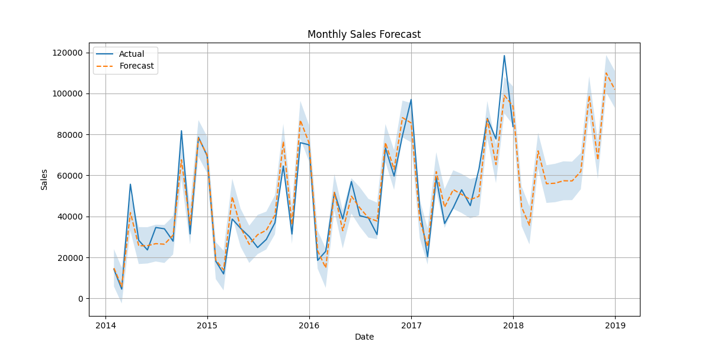

````markdown
# Sales & Demand Forecasting for Businesses

Machine Learning Task 1 for Future Interns (2026)

## 📌 Project Overview

Businesses need accurate sales forecasts to make informed decisions about inventory, staffing, and cash flow. This project uses historical sales data from the Superstore dataset to predict future sales trends using Facebook Prophet.

The forecast results are visualized in an interactive Power BI dashboard that highlights actual vs forecasted sales, confidence intervals, and key metrics.

---

## 🎯 Objective

Build a machine learning model that forecasts future sales trends and provides actionable business insights through visual analytics.

---

## 🛠️ Tools & Technologies Used

- Python
- Pandas
- NumPy
- Prophet
- Scikit-learn
- Matplotlib
- Power BI
- VS Code

---

## 📂 Dataset

**Sample - Superstore Dataset**

The dataset contains:
- Order Date
- Sales
- Profit
- Quantity
- Category
- Customer Segment
- Region

---

## 🔍 Project Workflow

### 1. Data Preprocessing
- Converted `Order Date` to datetime format
- Aggregated sales data by month
- Renamed columns to Prophet format:
  - `ds` → Date
  - `y` → Sales

### 2. Forecasting Model
- Trained a Prophet model with yearly seasonality
- Forecasted the next 12 months
- Generated:
  - `yhat` (predicted sales)
  - `yhat_lower`
  - `yhat_upper`

### 3. Model Evaluation
Evaluated forecast performance using:
- MAE (Mean Absolute Error)
- RMSE (Root Mean Squared Error)
- MAPE (Mean Absolute Percentage Error)

### 4. Visualization
Created:
- Forecast plot with confidence interval
- Trend and seasonality component plots
- Power BI dashboard with interactive slicers and KPI cards

---

## 📊 Dashboard Features

The Power BI dashboard includes:

- Actual vs Forecast Comparison
- Monthly Sales Forecast
- Confidence Interval Visualization
- Total Forecast Sales
- Average Monthly Forecast
- Minimum Forecast Value
- Interactive Date Filter

---

## 📈 Key Results

- Total Forecast Sales: **1.74M**
- Average Monthly Forecast: **56.18K**
- Minimum Forecast Value: **14.90K**

---

## 🖼️ Dashboard Preview


---

## 📉 Forecast Visualizations

### Forecast Plot


### Components Plot


---

## 📁 Project Structure

FUTURE_ML_01/
│
├── code/
│   ├── data_preprocessing.py
│   ├── prophet_model.py
│   ├── evaluation.py
│   └── requirements.txt
│
├── data/
│   ├── Sample - Superstore.csv
│   └── forecast_results.csv
│
├── dashboard/
│   ├── Task1_Dashboard.pbix
│   └── dashboard_preview.png
│
├── visuals/
│   ├── forecast_plot.png
│   └── components_plot.png
│
└── README.md

---

## 💡 Business Insights

The forecasting model helps businesses plan proactively.

### If forecasted sales increase:
- Increase inventory levels
- Schedule more staff
- Prepare for higher cash requirements

### If forecasted sales decrease:
- Reduce stock orders
- Optimize operational costs
- Avoid overproduction

This system enables businesses to make informed decisions rather than reacting to demand changes after they occur.

---

## 🚀 How to Run the Project

1. Install required libraries:
   ```bash
   pip install -r code/requirements.txt
````

2. Run data preprocessing:

   ```bash
   python code/data_preprocessing.py
   ```

3. Train the forecasting model:

   ```bash
   python code/prophet_model.py
   ```

4. Evaluate the model:

   ```bash
   python code/evaluation.py
   ```

5. Open the Power BI dashboard:

   ```text
   dashboard/Task1_Dashboard.pbix
   ```

---

## 📌 GitHub Repository

[https://github.com/varun-padavala/FUTURE_ML_01](https://github.com/varun-padavala/FUTURE_ML_01)

---

## 🙌 Acknowledgements

* Future Interns
* Facebook Prophet
* Microsoft Power BI
* Kaggle

---

## 📬 Contact

**Varun Padavala**

GitHub: [https://github.com/varun-padavala](https://github.com/varun-padavala)
LinkedIn: [https://www.linkedin.com/](https://www.linkedin.com/)

```
```
